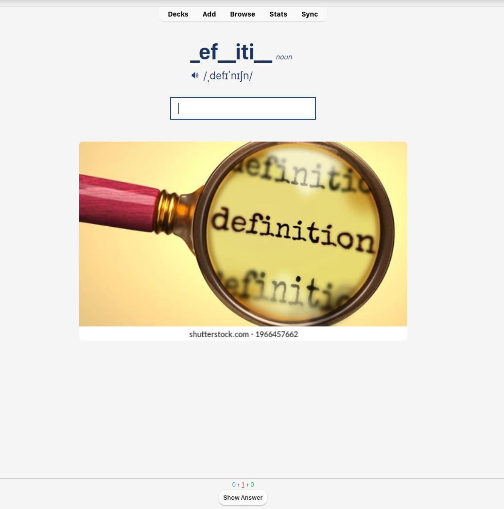
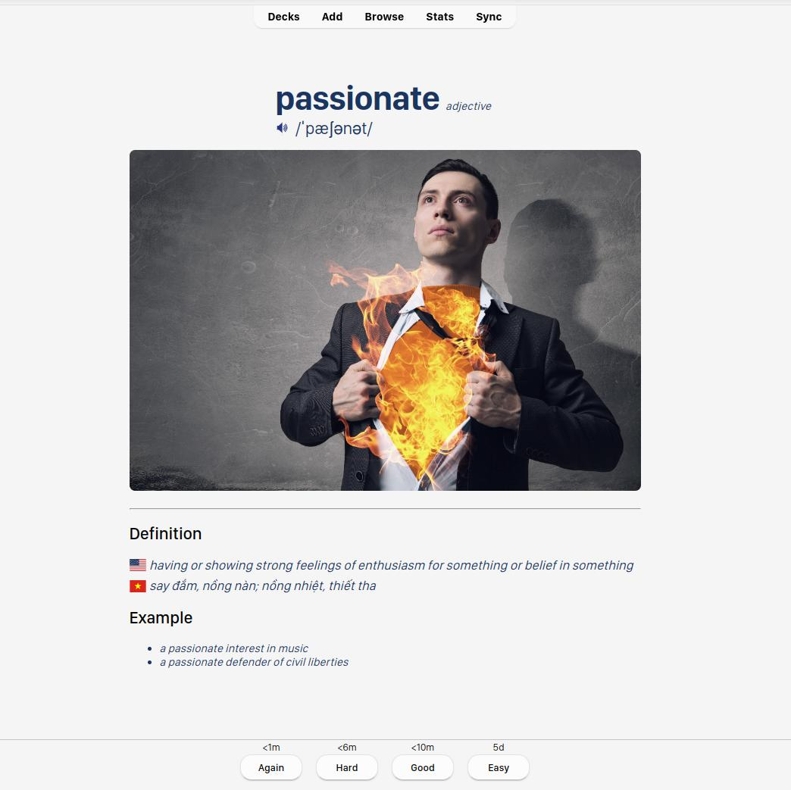

# Customized Anki Card - Inspired by [Oxford Learner's Dictionary](https://www.oxfordlearnersdictionaries.com/)

## Demo

`index.html`

## Front Side

## Back Side

## Introduction

This is an Anki Card template customized for my personal learning purposes (English)

This Anki Decks including 8 fields:

- Word

   The word that you want to learn.

- IPA

   International Phonetic Alphabet.

- WordType

   Type of this word (`n/adj/..`).

- Audio

   The `url` to the audio that contains the pronunciation of this word.

   Example: `https://www.oxfordlearnersdictionaries.com/media/english/uk_pron/d/def/defin/definition__gb_2.mp3`

- Image

   The `url` to the image that demonstrates this word.
   
   Example: `https://images.huffingtonpost.com/2016-09-27-1475000926-901492-2016bestworstcitiesforsoccerfans-thumb.jpg`

- VieDefinition

   The definition of this word in your native language.

- EngDefinition

   The definition of this word in the language which you want to learn.

- Examples

   `How to use this word?`

## Setting up

- Copy content of `back_anki.html` and `front_anki.html` to `Front Template` and `Back Template` in your Anki Cards.

   - Change replace all card field `{{Your Card Field}}`

- Copy content of `style.css` to `Styling` tab.

## Features

- Retype word, check typos and random cloze.
- Updating ...