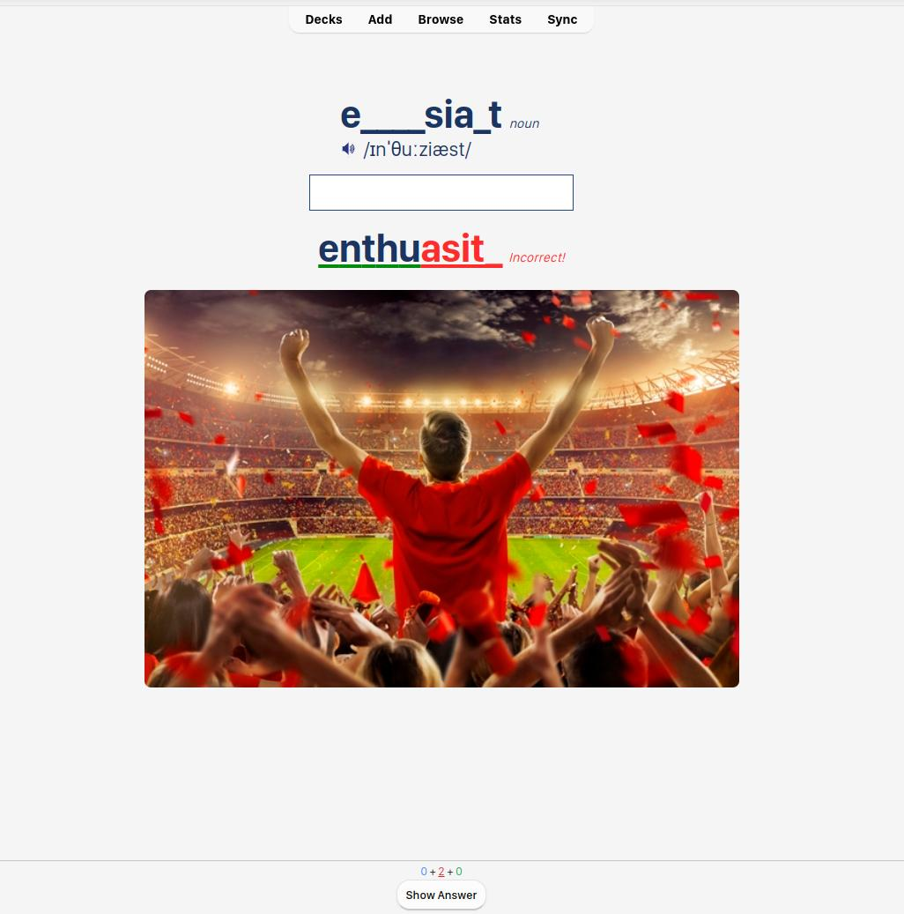

# Customized Anki Card - Inspired by [Oxford Learner's Dictionary](https://www.oxfordlearnersdictionaries.com/)


## Front Side



## Back Side


## Setting up

- Copy content of `back_anki.html` and `front_anki.html` to `Front Template` and `Back Template` in your Anki Cards.

   - Chang replace all card field `{{Your Card Field}}`

- Copy content of `style.css` to `Styling` tab and wrap it with a `style` tag.

```html
<style>
   /* Content of style.css */
</style>
```

## Usage
Updating ...